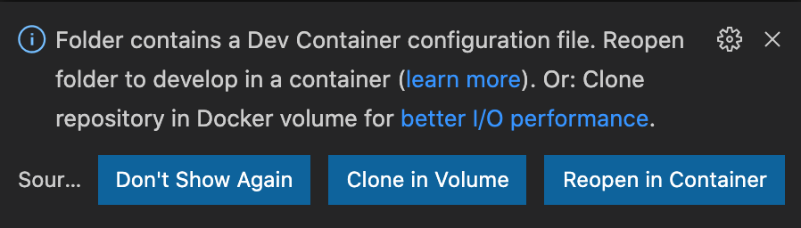

<p  align="center">


<a  href="https://github.com/tgmarinho/README-ecoleta/commits/master">

</a>

</p>

### Objetivo
- É Desenvolver uma aplicação e mostrar como a Netflix desenvolveu o filme **Black Mirror: Bandersnatch**;
- Servir o vídeo na resolução adquada para internet do usuário;

### Pré-requisitos
- [Docker](https://www.docker.com/get-started)
- [VSCode](https://code.visualstudio.com/download)
- [Remote-Containers](https://marketplace.visualstudio.com/items?itemName=ms-vscode-remote.remote-containers)

#### Instruções:

```bash
# Clone este repositório
$ git clone https://github.com/williammoreschi/js-expert-week.git

# Acesse a pasta do projeto no terminal/cmd
$ cd js-expert-week

# Abra o projeto com o VSCode
$ code .
```

Quando o [VSCode](https://code.visualstudio.com/download) abrir você verá uma mensagem informando que foram detectadas as configurações necessárias para que a extensão [Remote-Containers](https://marketplace.visualstudio.com/items?itemName=ms-vscode-remote.remote-containers) faça a mágica acontecer.



Clique em **"Reopen in Container"**. O VSCode vai reiniciar e é só aguardar o ambiente ficar pronto para você.

🕐 Pode demorar um pouco na primeira vez se você nunca tiver feito o download dos containers necessários, mas vale a pena!
  

Quando finalizar, você terá um terminal dentro do VSCode que já está dentro do container.

💡 Tudo que você executar nesse terminal será executado dentro do container apenas!

```bash
#execute o script que gera os vídeos em vários formatos
$ sh script.sh
```

🕐 pode ser que demore um pouco, depende do seu ambiente. Verifique as pastas que vão sendo criadas em *assets/timeline*.

### Créditos
- Base desse projeto feito pelo [Pedro Renan](https://github.com/pedrorenan) o projeto [js-expert-week](https://github.com/pedrorenan/js-expert-week). 
- Layout da lista foi baseada no codepen do [Carlos Avila](https://codepen.io/cb2307/pen/XYxyeY)
- Layout do video foi baseado no codepen do [Benjamin Pott](https://codepen.io/benjipott/pen/JELELN)


>O [Pedro Renan](https://github.com/pedrorenan) escreveu um post muito bacona sobre [VSCode](https://code.visualstudio.com/download) e [Remote-Containers](https://marketplace.visualstudio.com/items?itemName=ms-vscode-remote.remote-containers) se quiser ler um pouco mais sobre o assunto, é só acessar ["Em busca da independência para o ambiente de desenvolvimento"](https://medium.com/@pedrorenan/em-busca-da-independ%C3%AAncia-para-o-ambiente-de-desenvolvimento-2adc22f6f250).